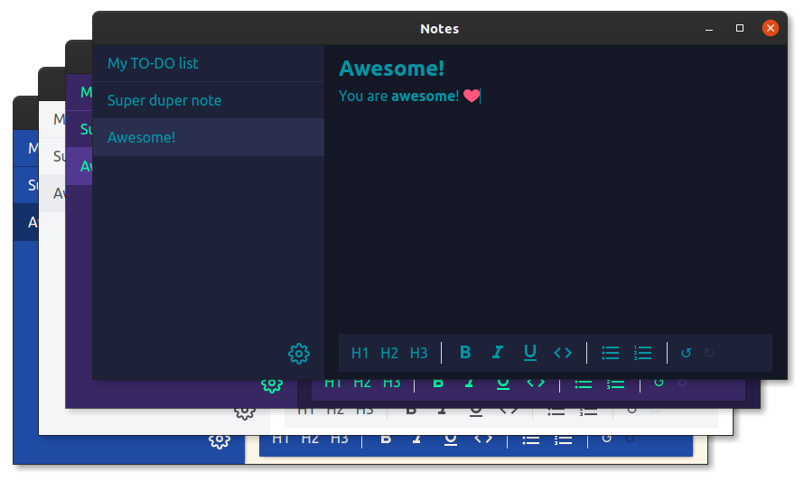

<h2 align="center">Notes</h2>

A handy desktop notes app built with electron.

---

---

## Features

- Persistent notes, saves as you edit
- Offline-only
- Note styling (title, lists, bold, italic, code)
- Emoji support (enter : for emoji search)
- Themes (light and dark)

---

### Contribution

Feel free to contribute.
